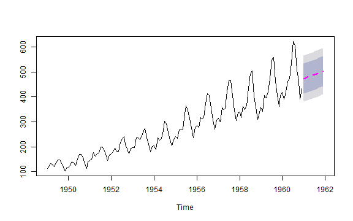

## Requirements

In my organization there is a need to expand the knowledge of analytics.

Many of the decision makers do not have a strong mathematical background.

There is a need for a simple application where people can play around with
different forecasting models on different data sets in order to visualize the models capabilities.

The user should be able to:

1. Easily access the application.
2. Use four different univariate time series data sets. 
3. Apply four different forecasting models of incresing complexity.
4. Forecast from 0 to 48 month (4 years).
5. Download the forecasted values for inspection. 

--- .class #id 

## Solution 
To meet the requirements the following was performed:

- The application was build in Shiny and published on the web.
- Four different time-series was used from the 'fma' R package.
- Four models from the 'forecast' R pacakge was implemented.
  Models was implemented such that the user should not need to make any considerations.
- A slider controlling the number of months to forecast was put in place.
- A download button was implemented.

---

## Implementation
Using the 'forecast' package the model implementation can be made easily.
An example of the simple model implementation from the 'forecast' pacakge is seen below:


```r
library(fma); library(forecast);data <- airpass;
fit<- tslm(data ~ trend) # Fit a linear model
fcast <- forecast(fit,h = 12) # Forecast it based on the user input (Here set to 12)
plot(fcast,fcol = 6,plot.conf=TRUE,flty=2,xlab="Time",main="") # Plot forecast
```

 

---

## Future Improvements
In order to improve the application the following could be considered:

- Enable the user to upload her own data set and apply models to.
- Implement more models.
- Improve model description.
- Make it so it is optimized to both laptop and desktop screens.


